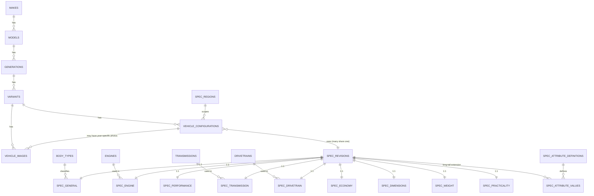

# Lav Auto — Database Schema (V1)

PostgreSQL, hosted on Supabase. All catalog tables are public-read via RLS and written
only by migrations/seed/ingestion scripts (service role) — no client write path exists
in V1.

> **Revision note (1):** this schema was revised after an architecture review focused on
> long-term identity integrity (see `ARCHITECTURE.md` §10 for the full deep dive, and
> §9 for why this was flagged as an expensive-to-change decision). The original design
> treated `variants` as the stable entity future
> systems would reference, with model year and market handled only inside an
> effective-dated `spec_revisions` row. That undercounted two real requirements: (a)
> model year needs to be independently addressable/indexable (URLs, SEO, sharing), and
> (b) a future Garage entry needs to capture *exactly* which year and market a user's
> car is, not just its trim name. This revision introduces `vehicle_configurations` as
> a new layer between `variants` and the spec tables to fix that before any
> user-generated content exists on top of it.
>
> **Revision note (2):** a follow-up review established Armenia as Lav Auto's primary
> V1 market (see `ARCHITECTURE.md` §11). That surfaced a naming/conceptual collision:
> the `markets` table introduced in revision (1) actually meant *regulatory/spec
> region* (US-spec vs. EU-spec figures) — but Armenia has no regulatory spec of its own
> and imports cars homologated for other regions, so "which country a car is
> commercially available/priced in" is a genuinely different axis from "which region's
> regulatory figures a configuration's numbers reflect." Conflating the two under one
> `markets` table would have made the Armenia-availability/pricing work (documented,
> not yet built — see `ARCHITECTURE.md` §11) ambiguous about which one it meant. This
> revision renames that table to `spec_regions` and adds a new, separate `countries`
> table for commercial/business geography, seeded with Armenia as the primary market.

## Design principles applied here

- **No giant `cars` table.** The hierarchy is modeled as real tables:
  `makes → models → generations → variants → vehicle_configurations`, with
  specifications normalized into per-category tables keyed off a reusable
  `spec_revisions` row — see §5 for why the spec content is decoupled from the
  identity rows that reference it.
- **Canonical numeric units only.** Every measurement column name encodes its unit
  (`length_mm`, `torque_nm`, `curb_weight_kg`). No formatted strings, no duplicate
  columns for alternate units. Conversion is a presentation-layer concern
  (`lib/units/*`), not a data-modeling one.
- **Reusable lookups, not repeated strings.** Engines, transmissions, drivetrains, body
  types, fuel types, aspiration, and spec regions are lookup tables referenced by ID, so
  (for example) the B58 engine's hardware facts are stored once even though it appears
  in many variants.
- **Regulatory spec region and commercial country are two different tables** (§6, §6.1)
  — a spec region says whose regulatory figures a configuration's numbers reflect
  (US-spec vs. EU-spec); a country says where Lav Auto operates commercially (Armenia
  first). Collapsing them would make the Armenia-market work in `ARCHITECTURE.md` §11
  ambiguous about which one it meant.
- **Identity is decoupled from content.** `vehicle_configurations` rows (one per
  variant × model year × spec region) are cheap, stable, and addressable, even when many of
  them point at the exact same `spec_revisions` content because nothing actually
  changed that year. This is what lets Lav Auto have a stable URL/ID for "2025 M340i
  xDrive" without duplicating spec values when 2024 and 2025 are identical.
- **Extensible by addition.** Common, frequently-compared specs get typed columns.
  Uncommon/long-tail specs go through a small typed extension mechanism (§5.4) that
  never requires a migration to add a new attribute. See the trade-off discussion there.
- **`vehicle_configurations` is the stable long-term join target** for future systems
  (garage, reviews, posts — see `ARCHITECTURE.md` §8–10), not `variants`. `variants`
  remains useful as a coarser identity for content that intentionally spans years (e.g.
  a "M340i owners" club), but anything that needs to know *exactly which car* — a
  Garage entry, a review, a listing — references a configuration.

## 1. Entity-relationship overview



Reading the hierarchy: a **variant** (e.g. "M340i xDrive" within the G20 generation) has
one **vehicle configuration** row per model year it was sold in, per regulatory spec
region it was built to — this is the precise, addressable, referenceable "2024 M340i
xDrive, US-spec" entity. Many configuration rows can point at the same **spec
revision** (the actual bag of spec values) when nothing changed year over year; a
facelift, power bump, or spec-region difference means a configuration points at a
*different* spec revision instead of duplicating one field at a time. (Which *country*
a car is commercially available or priced in is a separate axis — see §6.1 and
`ARCHITECTURE.md` §11.)

## 2. Hierarchy tables

```sql
create table makes (
  id            bigint generated always as identity primary key,
  slug          text not null unique,           -- e.g. 'bmw' — permanent, see ARCHITECTURE.md §9.1
  name          text not null,                   -- 'BMW' — identifier, not translated
  country       text,                             -- ISO 3166-1 alpha-2, nullable
  logo_url      text,
  is_active     boolean not null default true,
  created_at    timestamptz not null default now(),
  updated_at    timestamptz not null default now()
);

create table models (
  id            bigint generated always as identity primary key,
  make_id       bigint not null references makes(id) on delete restrict,
  slug          text not null,                   -- e.g. '3-series', unique per make
  name          text not null,                   -- '3 Series'
  created_at    timestamptz not null default now(),
  updated_at    timestamptz not null default now(),
  unique (make_id, slug)
);

create table generations (
  id                    bigint generated always as identity primary key,
  model_id              bigint not null references models(id) on delete restrict,
  slug                  text not null,            -- e.g. 'g20', unique per model
  code                  text,                     -- 'G20' — chassis code, untranslated identifier
  name                  text,                     -- optional display name, e.g. '7th Generation'
  production_start_year smallint not null,
  production_end_year   smallint,                 -- null = still in production
  created_at            timestamptz not null default now(),
  updated_at            timestamptz not null default now(),
  unique (model_id, slug),
  check (production_end_year is null or production_end_year >= production_start_year)
);
```

## 3. Variant (trim/engine/drivetrain/transmission line)

A **variant** is what the brief calls "Variant/Trim" — e.g. "M340i xDrive". It fixes the
trim name within a generation. It intentionally does **not** carry model year, spec
region, or spec data directly — those live on `vehicle_configurations` (§4) and
`spec_revisions` (§5), because the same trim name commonly persists across several
model years and spec regions with different underlying specs.

```sql
create table variants (
  id               bigint generated always as identity primary key,
  generation_id    bigint not null references generations(id) on delete restrict,
  slug             text not null,                -- e.g. 'm340i-xdrive', unique per generation
  name             text not null,                -- 'M340i xDrive' — untranslated identifier
  trim_level       text,                          -- optional free label, e.g. 'M Performance'
  is_active        boolean not null default true,
  created_at       timestamptz not null default now(),
  updated_at       timestamptz not null default now(),
  unique (generation_id, slug)
);
```

`variants` remains a legitimate, useful entity in its own right — it's what the
Generation page lists ("available variants," per the brief), and it's the right
granularity for future content that spans years by design (an owners' club for "the
M340i xDrive," not for "the 2024 M340i xDrive specifically"). It is simply no longer the
*most precise* identity, and future systems that need precision (Garage, reviews,
listings) reference `vehicle_configurations` instead — see §9 in `ARCHITECTURE.md`.

## 4. Vehicle Configurations — the stable per-year, per-spec-region identity

This is the table added by the identity review. A **configuration** is one
(variant, model year, spec region) combination — the answer to "exactly which car,
technically." It is the entity:

- the Vehicle page URL resolves to (see `ARCHITECTURE.md` §7 for the URL strategy),
- comparisons select (§ `COMPARISON_STATE.md`),
- and a future Garage entry references when the user's exact car is known
  (`ARCHITECTURE.md` §8).

`spec_region` here means the regulatory/homologation region whose figures the
configuration's numbers reflect (US-spec, EU-spec, ...) — it is **not** the same as
"which country this car is commercially sold or priced in." Armenia, for example, has
no regulatory spec of its own; Armenian-market cars are US-spec, EU-spec, Russian-market
-spec, etc. imports. That commercial/country dimension is `countries` (§6.1) and is used
by the separate, not-yet-built availability/pricing tables documented in
`ARCHITECTURE.md` §11 — see that section for why the two are kept apart.

```sql
create table vehicle_configurations (
  id                bigint generated always as identity primary key,
  variant_id        bigint not null references variants(id) on delete restrict,
  model_year        smallint not null,
  spec_region_id    bigint not null references spec_regions(id),  -- see §6; a 'GLOBAL' row exists for undifferentiated data
  spec_revision_id  bigint not null references spec_revisions(id) on delete restrict,
  is_verified        boolean not null default false,          -- convenience mirror of spec_revisions.is_verified at query time
  created_at         timestamptz not null default now(),
  updated_at         timestamptz not null default now(),
  unique (variant_id, model_year, spec_region_id)
);
create index on vehicle_configurations (variant_id);
create index on vehicle_configurations (spec_revision_id);
```

Notes:

- **Many configurations can share one `spec_revision_id`.** If the 2024 and 2025 US
  M340i xDrive are mechanically identical, both configuration rows point at the same
  spec revision — no duplicated numbers, but each year still has its own stable row, ID,
  and URL.
- **A facelift or mid-cycle power bump** is simply a later `model_year`'s configuration
  pointing at a *different* `spec_revision_id`. No separate "facelift" flag or entity is
  needed — it falls out of the model directly, which is what §9.2 in
  `ARCHITECTURE.md` explains was missing before this revision.
- **A spec-region difference** (US-spec vs EU-spec M340i xDrive, same model year) is two
  configuration rows — same `variant_id`, same `model_year`, different
  `spec_region_id` — typically pointing at different spec revisions, since the actual
  figures usually differ.
- **This table has no `slug` of its own.** It's addressed by composing the variant's
  path with its model year (and, when relevant, a spec-region qualifier) — see
  `ARCHITECTURE.md` §7. A dedicated slug would be redundant with that composition and
  would be one more thing to keep in sync.

## 5. Specifications

### 5.1 `spec_revisions` — reusable spec content

`spec_revisions` no longer carries `variant_id`, `market_id`, or a year range — those
belong to `vehicle_configurations` now (§4). A spec revision is simply a labeled,
provenance-tracked bag of spec values that one or more configurations can point at.

```sql
create table spec_revisions (
  id              bigint generated always as identity primary key,
  label           text,                                      -- optional admin-facing note, e.g. 'G20 M340i xDrive US, pre-facelift'
  is_verified     boolean not null default false,             -- true only once checked against a trusted source
  source          text,                                        -- free-text provenance note, e.g. 'seed/dev-data'
  created_at      timestamptz not null default now(),
  updated_at      timestamptz not null default now()
);
```

`is_verified` and `source` exist specifically because of the brief's "Do NOT fabricate
automotive specifications" requirement: every seed row must be identifiable as
development/test data until it's been checked against a real source.

### 5.2 Category tables (1:1 with `spec_revisions`)

Unchanged in structure from the original design — each table's primary key **is** the
foreign key to `spec_revisions`, enforcing the 1:1 relationship.

```sql
-- General
create table spec_general (
  spec_revision_id      bigint primary key references spec_revisions(id) on delete cascade,
  body_type_id           bigint not null references body_types(id),
  doors                  smallint,
  seats                  smallint,
  production_start_date  date,
  production_end_date    date
);

-- Engine
create table spec_engine (
  spec_revision_id  bigint primary key references spec_revisions(id) on delete cascade,
  engine_id         bigint not null references engines(id),
  horsepower_hp     integer,
  torque_nm         integer
);

-- Performance
create table spec_performance (
  spec_revision_id     bigint primary key references spec_revisions(id) on delete cascade,
  accel_0_100_kmh_sec  numeric(4,2),
  accel_0_60_mph_sec   numeric(4,2),
  top_speed_kmh        integer
);

-- Transmission
create table spec_transmission (
  spec_revision_id  bigint primary key references spec_revisions(id) on delete cascade,
  transmission_id   bigint not null references transmissions(id)
);

-- Drivetrain
create table spec_drivetrain (
  spec_revision_id  bigint primary key references spec_revisions(id) on delete cascade,
  drivetrain_id     bigint not null references drivetrains(id)
);

-- Economy
create table spec_economy (
  spec_revision_id           bigint primary key references spec_revisions(id) on delete cascade,
  fuel_consumption_l_100km   numeric(4,1),
  fuel_tank_liters           integer,
  battery_capacity_kwh       numeric(5,1),   -- null for non-EV/hybrid
  ev_range_km                integer         -- null for non-EV
);

-- Dimensions
create table spec_dimensions (
  spec_revision_id   bigint primary key references spec_revisions(id) on delete cascade,
  length_mm           integer,
  width_mm             integer,
  height_mm            integer,
  wheelbase_mm         integer,
  ground_clearance_mm  integer
);

-- Weight
create table spec_weight (
  spec_revision_id  bigint primary key references spec_revisions(id) on delete cascade,
  curb_weight_kg     integer,
  gross_weight_kg    integer
);

-- Practicality
create table spec_practicality (
  spec_revision_id     bigint primary key references spec_revisions(id) on delete cascade,
  cargo_capacity_liters integer,
  towing_capacity_kg    integer
);
```

### 5.3 Choosing typed columns vs. the long-tail extension (§5.4)

A spec earns a real typed column/table when **at least one** of these is true:

- it's used as a comparison-table row (the brief's named categories all qualify),
- it's a search/filter facet ("show me AWD cars under 1600kg"),
- it needs unit conversion (typed numeric columns are what makes `lib/units/*`
  possible at all — an untyped value can't be reliably converted),
- or it appears in structured data (`Vehicle`/`Product` JSON-LD) for SEO.

Everything else — uncommon, rarely-compared, rarely-filtered attributes ("heated
steering wheel," "number of USB-C ports," a market-specific regulatory attribute) — goes
through the extension mechanism below instead of a schema migration.

### 5.4 Long-tail specification extension (typed EAV, not open-ended EAV)

```sql
create table spec_attribute_definitions (
  id          bigint generated always as identity primary key,
  key         text not null unique,     -- 'heated_steering_wheel', 'usb_c_port_count', ...
  category    text not null,             -- loose grouping label for display, e.g. 'comfort', 'connectivity'
  data_type   text not null check (data_type in ('boolean', 'number', 'text')),
  unit        text,                       -- nullable; documents the canonical unit the same way a column name would
  created_at  timestamptz not null default now()
);

create table spec_attribute_values (
  id                       bigint generated always as identity primary key,
  spec_revision_id         bigint not null references spec_revisions(id) on delete cascade,
  attribute_definition_id  bigint not null references spec_attribute_definitions(id) on delete restrict,
  value_boolean            boolean,
  value_number             numeric,
  value_text               text,
  created_at               timestamptz not null default now(),
  unique (spec_revision_id, attribute_definition_id),
  check (
    (data_type_is_boolean and value_boolean is not null) or true -- see note below
  )
);
```

Trade-offs, and why this shape and not a plain `key text, value text` EAV table:

- **Typed value columns (`value_boolean`/`value_number`/`value_text`), not one untyped
  `value text` column.** A pure "everything is a string" EAV table pushes every type
  decision into application code and makes it easy to write `"true"` in one row and
  `"1"` in another for the same boolean attribute. Splitting by `data_type` keeps a
  guarantee at the database boundary, at the cost of a few always-null columns per row
  — an acceptable trade for correctness on data that may eventually feed comparison
  UI. (The `check` constraint above is illustrative — enforcing "the right column is
  populated for this attribute's `data_type`" in Postgres cleanly needs either a
  trigger or is more practically left to a Zod schema in `lib/data/*` at the
  application boundary; note this explicitly as an implementation detail to settle in
  Phase 1, not a reason to weaken the table shape.)
- **No migration to add an attribute.** Adding "adaptive cruise control" is an `insert`
  into `spec_attribute_definitions`, not a `create table`/`alter table`. This is the
  entire point of the mechanism.
- **Costs, accepted deliberately:** long-tail attributes can't be indexed/filtered as
  cheaply as a native column, and every read that needs them is a join +
  pivot instead of a plain column read. This is fine *because* they're long-tail by
  definition — low query frequency is the trade-off being made.
- **Promotion path, expected and normal:** if a long-tail attribute turns out to matter
  a lot (becomes a comparison-table row or filter facet), promote it: add a real typed
  column/table, backfill by copying out of `spec_attribute_values`, then stop writing
  new values for that key into the extension table. This is the same lifecycle that
  produced `spec_economy.ev_range_km` as a first-class column instead of a long-tail
  attribute — EV range clearly matters enough to earn one.
- **Not used for anything in §5.2.** The nine named categories in the brief are exactly
  the "common and important" set — they get real columns from day one. The extension
  table exists for what the brief anticipates ("far more specifications... including
  uncommon attributes") without knowing today what they'll be.

Attribute `key`s are translated the same way lookup table slugs are (see
`LOCALIZATION.md`): `t('specs.attribute.' + key)`, not stored per-locale in the
database.

## 6. Lookup tables

```sql
create table body_types (
  id    bigint generated always as identity primary key,
  slug  text not null unique,   -- 'sedan', 'coupe', 'suv', 'hatchback', 'wagon', 'convertible', 'pickup', 'van'
  name  text not null            -- English fallback label; UI translates via slug, see LOCALIZATION.md
);

create table fuel_types (
  id    bigint generated always as identity primary key,
  slug  text not null unique,   -- 'petrol', 'diesel', 'hybrid', 'phev', 'electric', 'hydrogen'
  name  text not null
);

create table engines (
  id             bigint generated always as identity primary key,
  code           text,                     -- 'B58B30' — untranslated identifier, nullable (EVs may not have one)
  fuel_type_id   bigint not null references fuel_types(id),
  displacement_cc integer,                 -- null for EVs
  cylinders      smallint,                 -- null for EVs
  configuration  text,                     -- 'inline', 'v', 'boxer', 'rotary', 'electric' — enum-like, translated by value
  aspiration     text,                     -- 'natural', 'turbo', 'twin_turbo', 'supercharged', 'electric'
  created_at     timestamptz not null default now(),
  unique (code)
);
-- Note: horsepower/torque are NOT stored here — the same physical engine can be tuned
-- differently across configurations. Output figures live on spec_engine (§5.2).

create table transmissions (
  id          bigint generated always as identity primary key,
  type        text not null,      -- 'manual', 'automatic_torque_converter', 'dct', 'cvt', 'single_speed'
  gear_count  smallint,           -- null for single-speed EV transmissions
  name        text,               -- optional descriptive label, e.g. '8-Speed Automatic (ZF 8HP)'
  unique (type, gear_count, name)
);

create table drivetrains (
  id    bigint generated always as identity primary key,
  code  text not null unique,    -- 'FWD', 'RWD', 'AWD', '4WD'
  name  text not null
);

create table spec_regions (
  id    bigint generated always as identity primary key,
  code  text not null unique,    -- 'US', 'EU', 'UK', 'JP', 'GLOBAL', ...
  name  text not null
);
-- A 'GLOBAL' row is seeded and used as the default spec region for catalog entries
-- that haven't been differentiated by region yet — see ARCHITECTURE.md §7 (URL
-- strategy) for how this keeps V1's UI simple without leaving a nullable, ambiguous
-- region on the one table (vehicle_configurations) whose whole job is precise identity.
-- NOTE: this is the *regulatory/homologation* region (which figures a configuration's
-- numbers reflect), not a commercial market. See §6.1 for the country/commercial-market
-- table this is deliberately kept separate from.
```

Lookup table values are translated in the UI via `slug`/`code` as a translation key
(see `LOCALIZATION.md`) — they intentionally do not have per-locale name columns. This
is a fixed, small, developer-curated enum set, not user-authored content.

### 6.1 `countries` — commercial/business geography (Armenia-first)

A separate lookup from `spec_regions` (§6), added for Lav Auto's Armenia-first market
strategy (`ARCHITECTURE.md` §11). `countries` represents *where Lav Auto operates
commercially* — availability, dealers, pricing — which is independent of which
regulatory spec a given car was built to. It is created now, in V1, even though nothing
yet references it (`vehicle_availability`, `price_observations`, and dealer/listing
tables are documented but not built — see `ARCHITECTURE.md` §11) because it's a cheap,
stable lookup that makes "Armenia is the primary market" a concrete fact in the schema
from day one, not something deferred to whenever pricing ships.

```sql
create table countries (
  id             bigint generated always as identity primary key,
  code           text not null unique,     -- ISO 3166-1 alpha-2, e.g. 'AM'
  name           text not null,
  currency_code  text not null,             -- ISO 4217 default display currency, e.g. 'AMD' for Armenia
  is_primary     boolean not null default false,  -- exactly one row should be true; enforced by seed data + app convention in V1, not a DB constraint (single-row scale doesn't justify one yet)
  is_active      boolean not null default true,
  created_at     timestamptz not null default now()
);
-- V1 seed: a single row — ('AM', 'Armenia', 'AMD', is_primary = true). Adding a second
-- country later (e.g. Georgia, Russia) is one insert here; it touches no other table
-- in this document — see ARCHITECTURE.md §11 for why that's the point of this split.
```

## 7. Images

```sql
create table vehicle_images (
  id                        bigint generated always as identity primary key,
  variant_id                bigint not null references variants(id) on delete cascade,
  vehicle_configuration_id  bigint references vehicle_configurations(id) on delete set null,  -- optional: year/market-specific photo
  provider                  text not null,     -- 'seed_local' | 'external_api' | 'supabase_storage'
  external_ref              text,               -- provider-specific ID/key, opaque to the app
  url                       text not null,
  position                   smallint not null default 0,
  is_primary                 boolean not null default false,
  created_at                 timestamptz not null default now()
);
create index on vehicle_images (variant_id, position);
create index on vehicle_images (vehicle_configuration_id);
```

`provider` + `external_ref` keep the app decoupled from any one image vendor — see
`ARCHITECTURE.md` §2 risk #6. Alt text is generated at render time from the vehicle's
identity fields via an i18n template, not stored per image (avoids a translation table
for what's a mechanically-derivable string).

## 8. Indexes worth calling out

```sql
create index on models (make_id);
create index on generations (model_id);
create index on variants (generation_id);
-- vehicle_configurations indexes are declared inline in §4

-- search
create extension if not exists pg_trgm;
create index on makes using gin (name gin_trgm_ops);
create index on models using gin (name gin_trgm_ops);
create index on variants using gin (name gin_trgm_ops);
```

`pg_trgm` trigram indexes back a simple `ILIKE`/similarity search via a Supabase RPC
function for V1 — sufficient for a catalog this size without introducing a dedicated
search service (Algolia/Elasticsearch) prematurely. Revisit if/when the catalog and
query volume outgrow it.

## 9. Row Level Security

```sql
alter table makes enable row level security;
alter table models enable row level security;
alter table generations enable row level security;
alter table variants enable row level security;
alter table vehicle_configurations enable row level security;
alter table spec_revisions enable row level security;
alter table spec_general enable row level security;
alter table spec_engine enable row level security;
alter table spec_performance enable row level security;
alter table spec_transmission enable row level security;
alter table spec_drivetrain enable row level security;
alter table spec_economy enable row level security;
alter table spec_dimensions enable row level security;
alter table spec_weight enable row level security;
alter table spec_practicality enable row level security;
alter table spec_attribute_definitions enable row level security;
alter table spec_attribute_values enable row level security;
alter table vehicle_images enable row level security;
alter table body_types enable row level security;
alter table fuel_types enable row level security;
alter table engines enable row level security;
alter table transmissions enable row level security;
alter table drivetrains enable row level security;
alter table spec_regions enable row level security;
alter table countries enable row level security;

-- one read-only policy per table, e.g.:
create policy "public read" on makes for select using (true);
-- ...repeated per table above. No insert/update/delete policy exists for the
-- anon/authenticated roles in V1 — all writes happen via migrations/seed scripts
-- using the service role, which bypasses RLS.
```

## 10. What's intentionally NOT in this schema yet

- No `users`, `garage_vehicles`, `posts`, `reviews`, `clubs`, `businesses`, or any table
  referencing `auth.users` — see `ARCHITECTURE.md` §8 for how they attach later,
  including exactly how a future `garage_vehicles` table should reference
  `vehicle_configurations`.
- **No pricing/currency tables.** Not in the V1 brief. `ARCHITECTURE.md` §11 documents
  the intended future shape (`price_types`, `price_observations`, dealer/used pricing)
  in enough detail to confirm nothing here assumes a single universal price — there is
  no price column anywhere in this schema, on purpose.
- **No `vehicle_availability` table.** Whether a given configuration is officially
  offered, dealer-available, importer-available, or used-market-only in Armenia (or any
  other country) is a real, planned concern — but populating it means real, sourced
  data entry, which doesn't exist yet ("do not add fake or manually guessed Armenian
  prices" applies equally to fabricated availability claims). The shape is documented
  in `ARCHITECTURE.md` §11 so building it later is additive: a new table referencing
  `variants` and `countries`, no change to the catalog.
- **No dealer/importer/listing inventory tables.** Individual for-sale vehicles (with
  VIN, mileage, condition, asking price) belong to the future `businesses` subsystem
  (`ARCHITECTURE.md` §8, §11) and are a different concern from both the catalog and the
  aggregate availability/pricing tables above.
- No full CMS-style `translations` table — enum values and long-tail attribute labels
  are translated via static i18n keys (see `LOCALIZATION.md`); this is revisited only
  if/when Lav Auto needs editor-authored per-locale long-form content.
