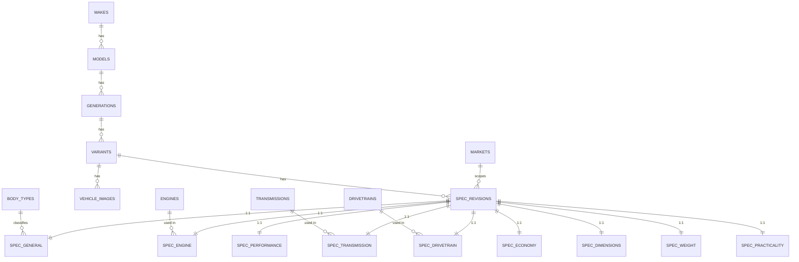

# Lav Auto — Database Schema (V1)

PostgreSQL, hosted on Supabase. All catalog tables are public-read via RLS and written
only by migrations/seed/ingestion scripts (service role) — no client write path exists
in V1.

## Design principles applied here

- **No giant `cars` table.** The hierarchy is modeled as real tables:
  `makes → models → generations → variants`, with specifications normalized into
  per-category tables keyed off an effective-dated `spec_revisions` row, not off the
  variant directly — see §3 for why.
- **Canonical numeric units only.** Every measurement column name encodes its unit
  (`length_mm`, `torque_nm`, `curb_weight_kg`). No formatted strings, no duplicate
  columns for alternate units. Conversion is a presentation-layer concern
  (`lib/units/*`), not a data-modeling one.
- **Reusable lookups, not repeated strings.** Engines, transmissions, drivetrains, body
  types, fuel types, aspiration, and markets are lookup tables referenced by ID, so
  (for example) the B58 engine's hardware facts are stored once even though it appears
  in many variants.
- **Extensible by addition.** Adding a new spec category later means adding a new
  `spec_<category>` table with a FK to `spec_revisions` — no change to existing tables,
  no migration of existing data.
- **`variants` is the stable long-term join target** for future systems (garage,
  reviews, posts — see `ARCHITECTURE.md` §8–9). Nothing else in this schema should be
  treated as a stable external reference.

## 1. Entity-relationship overview



Reading the hierarchy: a **variant** (e.g. "M340i xDrive" within the G20 generation) can
have one or more **spec revisions** over its production life — one row per period during
which its specs didn't change. A revision might span "2019–2021" and a new one starts at
a mid-cycle update ("2022–2023") without duplicating a row per individual year. Each
category table is a strict 1:1 extension of a spec revision, so a vehicle page loads its
full spec sheet with one row per category table, joined on `spec_revision_id`.

## 2. Hierarchy tables

```sql
create table makes (
  id            bigint generated always as identity primary key,
  slug          text not null unique,           -- e.g. 'bmw' — permanent, see ARCHITECTURE.md §9.1
  name          text not null,                   -- 'BMW' — identifier, not translated
  country       text,                             -- ISO 3166-1 alpha-2, nullable
  logo_url      text,
  is_active     boolean not null default true,
  created_at    timestamptz not null default now(),
  updated_at    timestamptz not null default now()
);

create table models (
  id            bigint generated always as identity primary key,
  make_id       bigint not null references makes(id) on delete restrict,
  slug          text not null,                   -- e.g. '3-series', unique per make
  name          text not null,                   -- '3 Series'
  created_at    timestamptz not null default now(),
  updated_at    timestamptz not null default now(),
  unique (make_id, slug)
);

create table generations (
  id                    bigint generated always as identity primary key,
  model_id              bigint not null references models(id) on delete restrict,
  slug                  text not null,            -- e.g. 'g20', unique per model
  code                  text,                     -- 'G20' — chassis code, untranslated identifier
  name                  text,                     -- optional display name, e.g. '7th Generation'
  production_start_year smallint not null,
  production_end_year   smallint,                 -- null = still in production
  created_at            timestamptz not null default now(),
  updated_at            timestamptz not null default now(),
  unique (model_id, slug),
  check (production_end_year is null or production_end_year >= production_start_year)
);
```

## 3. Variant (trim/engine/drivetrain/transmission combination)

A **variant** is what the brief calls "Variant/Trim" — e.g. "M340i xDrive". It fixes the
trim name and the specific engine/transmission/drivetrain combination within a
generation. It is deliberately *not* tied to a single model year, because the same trim
name commonly persists across several model years with only incremental spec changes —
that's what `spec_revisions` is for.

```sql
create table variants (
  id               bigint generated always as identity primary key,
  generation_id    bigint not null references generations(id) on delete restrict,
  slug             text not null,                -- e.g. 'm340i-xdrive', unique per generation
  name             text not null,                -- 'M340i xDrive' — untranslated identifier
  trim_level       text,                          -- optional free label, e.g. 'M Performance'
  is_active        boolean not null default true,
  created_at       timestamptz not null default now(),
  updated_at       timestamptz not null default now(),
  unique (generation_id, slug)
);
```

Note: `variants` does **not** carry engine/transmission/drivetrain/body-type columns
directly. Those live on `spec_revisions` (via `spec_engine`, `spec_transmission`, etc.)
because in principle even a fixed trim name could change engine mid-cycle (rare, but the
brief explicitly requires specs to vary "by engine" as an independent axis, not only by
trim). Keeping them on the revision, not the variant, avoids a future special case.

## 4. Lookup tables

```sql
create table body_types (
  id    bigint generated always as identity primary key,
  slug  text not null unique,   -- 'sedan', 'coupe', 'suv', 'hatchback', 'wagon', 'convertible', 'pickup', 'van'
  name  text not null            -- English fallback label; UI translates via slug, see LOCALIZATION.md
);

create table fuel_types (
  id    bigint generated always as identity primary key,
  slug  text not null unique,   -- 'petrol', 'diesel', 'hybrid', 'phev', 'electric', 'hydrogen'
  name  text not null
);

create table engines (
  id             bigint generated always as identity primary key,
  code           text,                     -- 'B58B30' — untranslated identifier, nullable (EVs may not have one)
  fuel_type_id   bigint not null references fuel_types(id),
  displacement_cc integer,                 -- null for EVs
  cylinders      smallint,                 -- null for EVs
  configuration  text,                     -- 'inline', 'v', 'boxer', 'rotary', 'electric' — enum-like, translated by value
  aspiration     text,                     -- 'natural', 'turbo', 'twin_turbo', 'supercharged', 'electric'
  created_at     timestamptz not null default now(),
  unique (code)
);
-- Note: horsepower/torque are NOT stored here — the same physical engine can be tuned
-- differently across variants. Output figures live on spec_engine (see §5).

create table transmissions (
  id          bigint generated always as identity primary key,
  type        text not null,      -- 'manual', 'automatic_torque_converter', 'dct', 'cvt', 'single_speed'
  gear_count  smallint,           -- null for single-speed EV transmissions
  name        text,               -- optional descriptive label, e.g. '8-Speed Automatic (ZF 8HP)'
  unique (type, gear_count, name)
);

create table drivetrains (
  id    bigint generated always as identity primary key,
  code  text not null unique,    -- 'FWD', 'RWD', 'AWD', '4WD'
  name  text not null
);

create table markets (
  id    bigint generated always as identity primary key,
  code  text not null unique,    -- 'US', 'EU', 'UK', 'JP', 'GLOBAL', ...
  name  text not null
);
```

Lookup table values are translated in the UI via `slug`/`code` as a translation key
(see `LOCALIZATION.md`) — they intentionally do not have per-locale name columns. This
is a fixed, small, developer-curated enum set, not user-authored content.

## 5. Specifications

### 5.1 `spec_revisions` — the effective-dated anchor

```sql
create table spec_revisions (
  id              bigint generated always as identity primary key,
  variant_id      bigint not null references variants(id) on delete cascade,
  market_id       bigint references markets(id),           -- null = unspecified/global
  year_start      smallint not null,                        -- first model year this revision applies to
  year_end        smallint,                                 -- last model year (inclusive); null = still current
  is_verified     boolean not null default false,           -- true only once checked against a trusted source
  source          text,                                      -- free-text provenance note, e.g. 'seed/dev-data'
  created_at      timestamptz not null default now(),
  updated_at      timestamptz not null default now(),
  unique (variant_id, market_id, year_start),
  check (year_end is null or year_end >= year_start)
);
```

`is_verified` and `source` exist specifically because of the brief's "Do NOT fabricate
automotive specifications" requirement: every seed row must be identifiable as
development/test data until it's been checked against a real source.

### 5.2 Category tables (1:1 with `spec_revisions`)

Each table's primary key **is** the foreign key to `spec_revisions`, enforcing the 1:1
relationship and making "does this vehicle have engine specs recorded" a simple existence
check.

```sql
-- General
create table spec_general (
  spec_revision_id      bigint primary key references spec_revisions(id) on delete cascade,
  body_type_id           bigint not null references body_types(id),
  doors                  smallint,
  seats                  smallint,
  production_start_date  date,
  production_end_date    date
);

-- Engine
create table spec_engine (
  spec_revision_id  bigint primary key references spec_revisions(id) on delete cascade,
  engine_id         bigint not null references engines(id),
  horsepower_hp     integer,
  torque_nm         integer
);

-- Performance
create table spec_performance (
  spec_revision_id     bigint primary key references spec_revisions(id) on delete cascade,
  accel_0_100_kmh_sec  numeric(4,2),
  accel_0_60_mph_sec   numeric(4,2),
  top_speed_kmh        integer
);

-- Transmission
create table spec_transmission (
  spec_revision_id  bigint primary key references spec_revisions(id) on delete cascade,
  transmission_id   bigint not null references transmissions(id)
);

-- Drivetrain
create table spec_drivetrain (
  spec_revision_id  bigint primary key references spec_revisions(id) on delete cascade,
  drivetrain_id     bigint not null references drivetrains(id)
);

-- Economy
create table spec_economy (
  spec_revision_id           bigint primary key references spec_revisions(id) on delete cascade,
  fuel_consumption_l_100km   numeric(4,1),
  fuel_tank_liters           integer,
  battery_capacity_kwh       numeric(5,1),   -- null for non-EV/hybrid
  ev_range_km                integer         -- null for non-EV
);

-- Dimensions
create table spec_dimensions (
  spec_revision_id   bigint primary key references spec_revisions(id) on delete cascade,
  length_mm           integer,
  width_mm             integer,
  height_mm            integer,
  wheelbase_mm         integer,
  ground_clearance_mm  integer
);

-- Weight
create table spec_weight (
  spec_revision_id  bigint primary key references spec_revisions(id) on delete cascade,
  curb_weight_kg     integer,
  gross_weight_kg    integer
);

-- Practicality
create table spec_practicality (
  spec_revision_id     bigint primary key references spec_revisions(id) on delete cascade,
  cargo_capacity_liters integer,
  towing_capacity_kg    integer
);
```

Adding a category later (e.g. "Safety" with airbag count and NCAP rating) is:
`create table spec_safety (spec_revision_id bigint primary key references
spec_revisions(id) on delete cascade, ...)` — nothing above needs to change.

## 6. Images

```sql
create table vehicle_images (
  id                bigint generated always as identity primary key,
  variant_id        bigint not null references variants(id) on delete cascade,
  spec_revision_id  bigint references spec_revisions(id) on delete set null,  -- optional: facelift-specific photo
  provider          text not null,     -- 'seed_local' | 'external_api' | 'supabase_storage'
  external_ref      text,               -- provider-specific ID/key, opaque to the app
  url               text not null,
  position           smallint not null default 0,
  is_primary         boolean not null default false,
  created_at         timestamptz not null default now()
);
create index on vehicle_images (variant_id, position);
```

`provider` + `external_ref` keep the app decoupled from any one image vendor — see
`ARCHITECTURE.md` §2 risk #6. Alt text is generated at render time from the vehicle's
identity fields via an i18n template, not stored per image (avoids a translation table
for what's a mechanically-derivable string).

## 7. Indexes worth calling out

```sql
create index on models (make_id);
create index on generations (model_id);
create index on variants (generation_id);
create index on spec_revisions (variant_id);

-- search
create extension if not exists pg_trgm;
create index on makes using gin (name gin_trgm_ops);
create index on models using gin (name gin_trgm_ops);
create index on variants using gin (name gin_trgm_ops);
```

`pg_trgm` trigram indexes back a simple `ILIKE`/similarity search via a Supabase RPC
function for V1 — sufficient for a catalog this size without introducing a dedicated
search service (Algolia/Elasticsearch) prematurely. Revisit if/when the catalog and
query volume outgrow it.

## 8. Row Level Security

```sql
alter table makes enable row level security;
alter table models enable row level security;
alter table generations enable row level security;
alter table variants enable row level security;
alter table spec_revisions enable row level security;
alter table spec_general enable row level security;
alter table spec_engine enable row level security;
alter table spec_performance enable row level security;
alter table spec_transmission enable row level security;
alter table spec_drivetrain enable row level security;
alter table spec_economy enable row level security;
alter table spec_dimensions enable row level security;
alter table spec_weight enable row level security;
alter table spec_practicality enable row level security;
alter table vehicle_images enable row level security;
alter table body_types enable row level security;
alter table fuel_types enable row level security;
alter table engines enable row level security;
alter table transmissions enable row level security;
alter table drivetrains enable row level security;
alter table markets enable row level security;

-- one read-only policy per table, e.g.:
create policy "public read" on makes for select using (true);
-- ...repeated per table above. No insert/update/delete policy exists for the
-- anon/authenticated roles in V1 — all writes happen via migrations/seed scripts
-- using the service role, which bypasses RLS.
```

## 9. What's intentionally NOT in this schema yet

- No `users`, `garage_vehicles`, `posts`, `reviews`, `clubs`, `businesses`, or any table
  referencing `auth.users` — see `ARCHITECTURE.md` §8 for how they attach later.
- No pricing/currency fields — not in the V1 brief; see `ARCHITECTURE.md` §2 risk #3.
- No full CMS-style `translations` table — enum values are translated via static i18n
  keys (see `LOCALIZATION.md`); this is revisited only if/when Lav Auto needs
  editor-authored per-locale long-form content.
